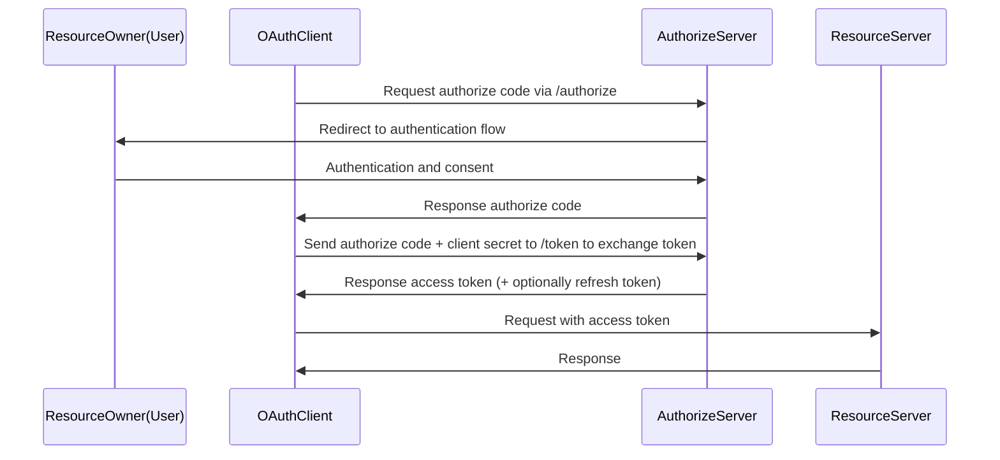

Dự án có config tích hợp với GHTK IAM với tư cách là bên thứ 3 thông qua luồng OIDC

=> Xem [auth](../src/configs/Auth)

## Các role quan trọng cần lưu ý

- Authorization server: Máy chủ cấp phát access token. (auth-service in IAM system).
- OpenID provider: TMáy chủ cấp phát ID token (auth-service in IAM system).
- Resource owner: Người dùng cuối được cấp quyền truy cập vào máy chủ tài nguyên bằng access token (người dùng và nhân viên GHTK).
- OAuth client: Ứng dụng yêu cầu access token từ hệ thống IAM.
- Resource server: Dịch vụ chấp nhận access token và phải xác minh rằng token đó hợp lệ.
- Identity Provider (IdP): Máy chủ sở hữu thông tin xác thực của người dùng, cung cấp cơ chế xác thực. (auth-service in IAM system)

## OAuth Flow



- Overview flow:

1. Xác thực người dùng: Ứng dụng gửi request đến endpoint `/authorize` để xác thực và cấp quyền cho user ([login](../src/configs/Auth/handler/login.ts)). Sau đó, server sẽ redirect đến ứng dụng của chúng ta với authorize code
2. Đổi code để lấy token: Ứng dụng nhận được authorize code, sử dụng nó để đổi lấy access token + refresh token ([callback](../src/configs/Auth/handler/callback.ts))
3. Sử dụng access token: Ứng dụng sử dụng access token để request đến resource server

- Set up config ứng dụng:

B1: Đăng ký 1 client mới với các thông tin sau:

- Type: Web
- Name
- Method: authorize_code
- Redirect URIs: {domainname}/api/auth/callback, http://localhost:3000/api/auth/callback
- Scopes: request scopes

B2: Sau khi xong, bạn sẽ nhận được `clientID` và `clientSecret` hãy setup nó vào biến môi trường như sau:

```
NEXT_PUBLIC_APP_URL=http://localhost:3000
NEXT_PUBLIC_OIDC_ISSUER=https://auth.ghtklab.com
NEXT_PUBLIC_OIDC_AUTH_URL=https://id.ghtklab.com
OIDC_REDIRECT_URI=http://localhost:3000/api/auth/callback
OIDC_CLIENT_ID={clientID}
OIDC_CLIENT_SECRET={clientSecret}

NEXT_PUBLIC_GCHAT_API_URL=https://chat.ghtklab.com
```

B3: Chạy `npm run dev`

### Author

quannt86
